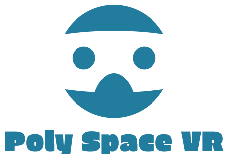
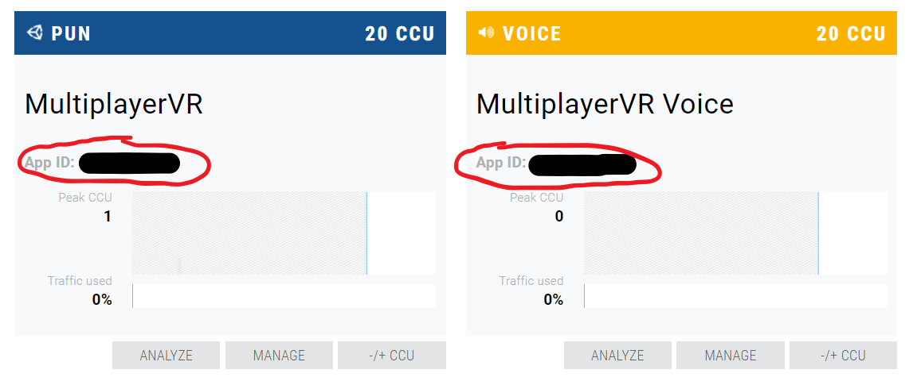
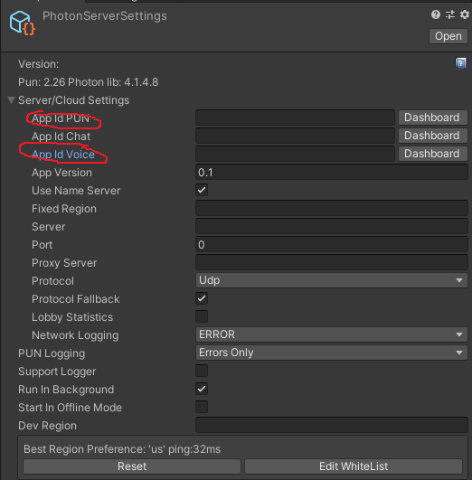
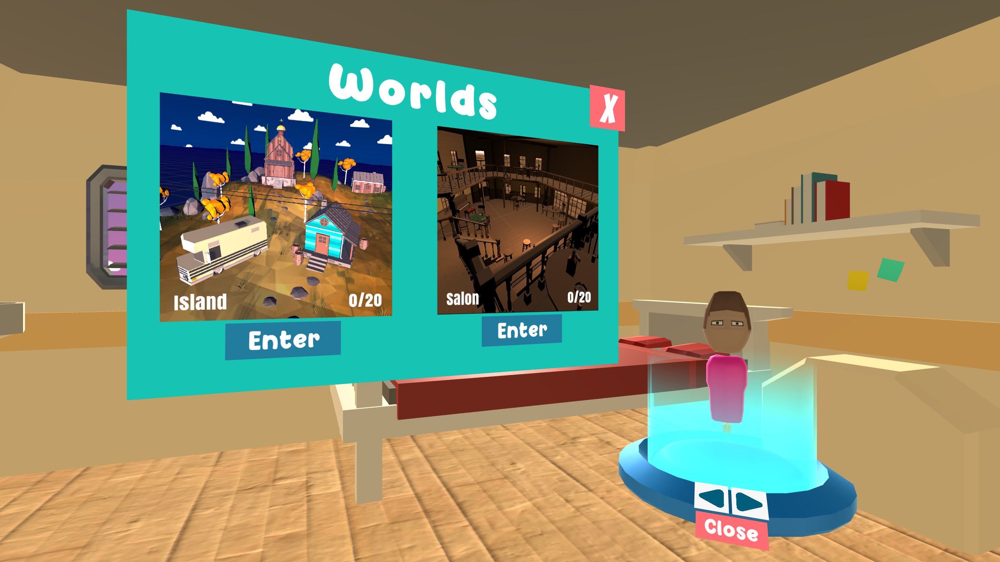
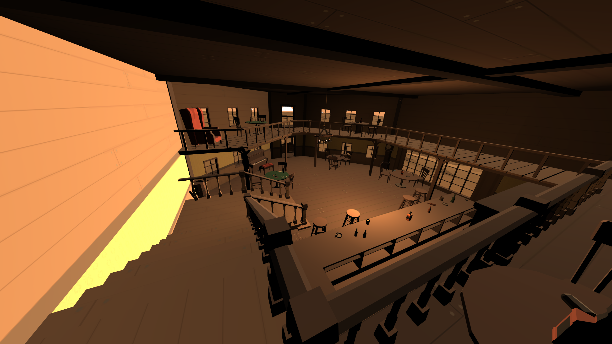
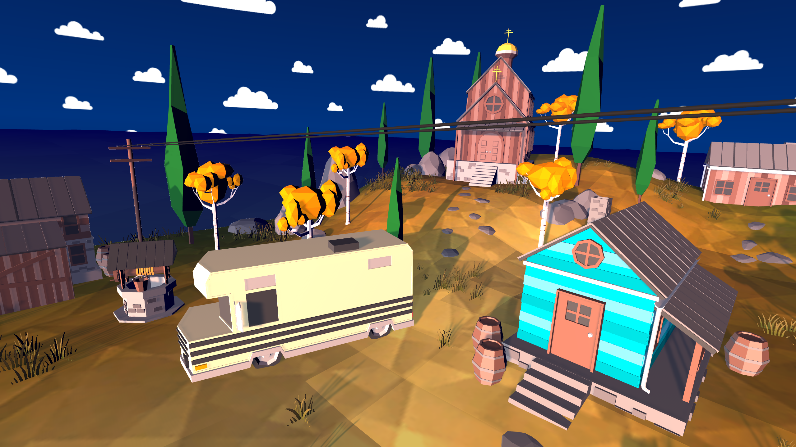

# Poly-Space-VR

Poly Space VR is a low poly, lightweight, open-source social platform where you can meet and chat with your friends in VR. You can create and share your own Poly Spaces by following the guidelines. Each month, a cool version of Poly Space VR will be selected and uploaded to Oculus Store so everyone can join in on the fun! 

This month's Poly Space is by: @jackyangzzh

## Why Another "Low-Poly-VR-Social Place"? ##

Glad you asked! Some of the more well-known VR platforms including VRChat and AltSpace are giant softwares that serve as places for all the users to gather. Here are some reasons why Poly Space VR is different: 

1. **Poly Space VR is completely open-source**: you can download the entire code, modify it and build to create a world of your own! 
2. **Poly Space VR is community maintained**: instead of waiting for developers to add features or to fix bug, you can simply fork a branch and do the improvements.
3. **Poly Space VR is light weight**: When platform becomes too large and comprehensive, there are many polygons to consider: from scenes to models to avatars and the list goes on. Poly Space VR is limited to 2 scene (with the possibly of expanding to 3 in the future) and use only low poly objects, so that it is very easy on the computational power.
4. **Poly Space VR is small**: The current VR social platforms have huge servers that allow tens and thousands of people on at a time. The server used by Poly Space VR is powered by Photon, and the free version only allows 20 people at a time. In other words, you can either host a small party for free or pay Photon to host a giant party.
5. **Poly Space VR is easy** : As mentioned previously, Poly Space VR is powered by Photon, which has a fantiastic library that makes things easy. Combined with this repositry and the following instruction, you can focus on creating your Poly Spaces instead!
6. **You Can Publish Your Game!**: The cool thing about an open-source game is that everyone get to play it, so feel free to send a cool version of Poly Space VR! Every month, I will select an amazing Poly Space VR and uploaded to the Oculus Store, so that everyone can join your space!

## Links ## 
- Github Page: https://jackyangzzh.github.io/Poly-Space-VR/ 
- Oculus Store: *Currently Under Review*
  
## How to run your own Poly Space ##
  1. Install Unity 2019.4.12
  2. Clone or fork the repository
  3. Create a Photon Engine account (https://www.photonengine.com/en-US/Photon)
  4. Go to Dashboard and "CREATE A NEW APP"
   - 
  5. Create a new Photon with type **Photon Pun**, enter information you need.
  6. Next, create another new application, but this time, with a new Photon type **Photon Voice**. After you create it, is should look something like this.
   - 
  7. Open up the project in Unity and open PhotonServerSettings file (under Assets/Photon/PhotonUnityNetworking/Resources)
   - 
  8. Enter AppIdPUN and AppIdVoice according to the ones on your Photon Dashboard  
  9. Just like, that you are ready! Have fun creating your own Poly Space! 
	    

## Guidelines on creating and submitting your own polyspace ##
1. No violence, sexual, racial or any other inappropriate content 
2. LOW POLY ONLY!
3. To submit your Poly Space, simply fork a branch and send me a message! 

## Restrictions ##
Here are some restrictions of Poly Space VR:

1. It currently only runs on Oculus devices (Rift, Rift S, and Quest) - more device support coming soon
2. The free version of Photon (networking engine that powers Poly Space VR) only allows 20 people at a time.

## Game Photos ##

## License ##